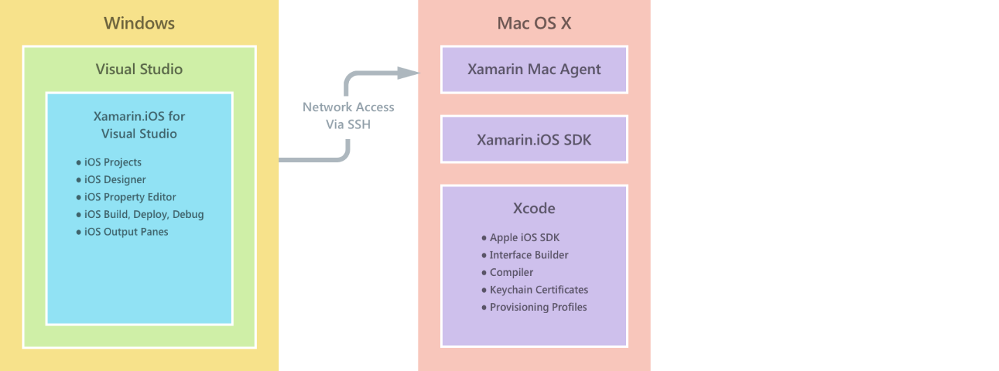

# Xamarin DevOps Hands On Lab

This hands 

------

##Lab1
[Lab 1.1](https://github.com/DXPortugal/Xamarin.Devops/blob/master/lab11.md) - Create your VSTS Subscription and Dev Team

[Lab 1.2](https://github.com/DXPortugal/Xamarin.Devops/blob/master/lab12.md) - Clone your project from Github

[Lab 1.3](https://github.com/DXPortugal/Xamarin.Devops/blob/master/lab13.md) - Create your Android Build Definition

[Lab 1.4](https://github.com/DXPortugal/Xamarin.Devops/blob/master/lab14.md) - Create your UWP Build Definition

[Lab 1.5](https://github.com/DXPortugal/Xamarin.Devops/blob/master/lab15.md) - Create your iOS Build Definition

[Lab 1.6](https://github.com/DXPortugal/Xamarin.Devops/blob/master/teste.md) - Set Continuous Integration

##Pre-Requisites
1. Visual Studio 2015 with Xamarin or Xamarin Studio
2. Git command line
3. Web access
4. A Microsoft account (liveID)

>NOTE: Each Visual Studio Team Services subscription is free to 5 developers withou a Visual Studio License with MSDN. Form teams of max 5.

## Sign up for accounts

-   [Visual Studio Dev Essentials](https://www.visualstudio.com/products/visual-studio-dev-essentials-vs.aspx). This free program provides easy access to many developer tools and services, including Visual Studio, Visual Studio Team Services, and Azure. It gives you a $25/month credit on Azure for 12 months. It also includes subscriptions to Pluralsight training and Xamarin University. You can also sign up separately for free tiers of [Azure](https://azure.com) and [Visual Studio Team Services](https://www.visualstudio.com/products/visual-studio-team-services-vs.aspx), but these do not provide Azure credits.

-   [HockeyApp](https://rink.hockeyapp.net/) (optional), for managing test distribution of mobile apps and collecting telemetry.

-   [Xamarin](https://xamarin.com/) (required), for building the mobile app and running debug runs and tests on [Xamarin Test Cloud](https://xamarin.com/test-cloud).

-   [GitHub](https://github.com/Azure-Samples/MyDriving/) (optional), to create free public repositories for your own code (private repositories are paid). Alternatively, you can use the basic plan in Visual Studio Team Services for private repositories.

-   [Power BI](https://powerbi.microsoft.com/) (optional), to create rich visualizations of data across the entire system.

## Install development tools

The following setup is for developing the full solution: an iOS, Android, and Windows 10 Mobile cross-platform app.

As an alternative, you can use Xamarin Studio on either Mac or Windows to develop the mobile apps.

There's a [longer description of this setup](https://msdn.microsoft.com/library/mt613162.aspx).

### Windows development machine

The central tool on Windows is Visual Studio, for working with the MyWeather app for Android and Windows

Xamarin, Git, emulators, and other useful components are all integrated with Visual Studio.

Install:

-   [Visual Studio 2015 with Xamarin](https://www.visualstudio.com/products/visual-studio-community-vs) (any edition--Community is free).

Also, make sure that you have the right Visual Studio extensions. Check that under **Tools**, you see **Android, iOS, Xamarin…**. If not, open Control Panel, and then select **Programs and Features** > **Microsoft** > **Visual Studio 2015** > **Modify**. Under **Cross-Platform development**, select **C\#/.Net (Xamarin)**. While you're there, check that **GitHub** is installed.

### Mac development machine

The Mac (Yosemite or later) is required if you want to develop for iOS. Although we use Visual Studio with Xamarin on Windows to develop and manage all the code, Xamarin uses an agent installed on a Mac in order to build and sign the iOS code.

(As an alternative, you can use Xamarin Studio directly on the Mac to develop cross-platform apps.)

You don't need the Mac if you don't want to include iOS as a target platform.

Install:

-   [Xamarin Studio for iOS](https://developer.xamarin.com/guides/ios/getting_started/installation/mac/). You can also set up Visual Studio and Xamarin on a Mac that's running a Windows virtual machine. See [Setup, install, and verifications for Mac users](https://msdn.microsoft.com/library/mt488770.aspx) on MSDN.

Enable remote login on the Mac. Open **System Preferences** > **Sharing**, and then select **Remote Login**.

When you open an iOS project in Visual Studio on Windows, the Xamarin plug-in will prompt you for the ID of the Mac.

## Fetch the GitHub repository

Fetch a local copy of [the GitHub Xamarin.DevOps repository](https://github.com/DXPortugal/Xamarin.Devops) by using the **Download ZIP** button in GitHub, Visual Studio, or another Git client.

Unzip the file to a folder with a short path name, such as C:\\code.

Alternatively, if you want to keep up to date with or contribute to our code, clone the repository as follows:

**git clone https://github.com/DXPortugal/Xamarin.Devops.git**
