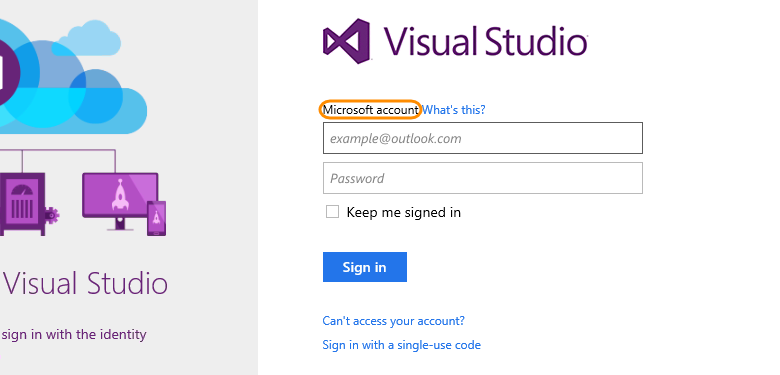
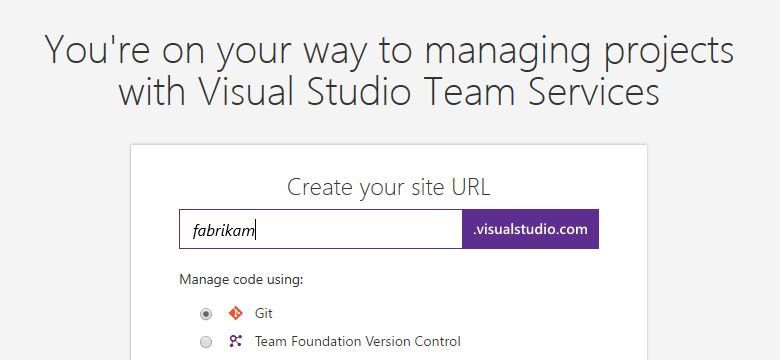
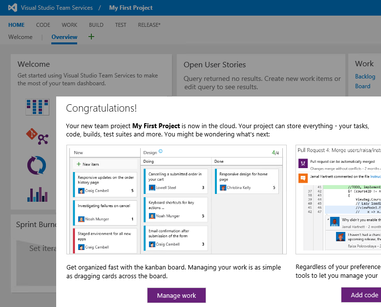
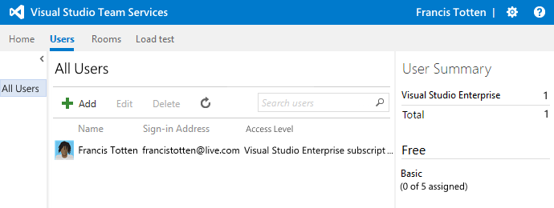
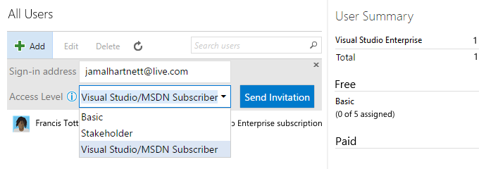
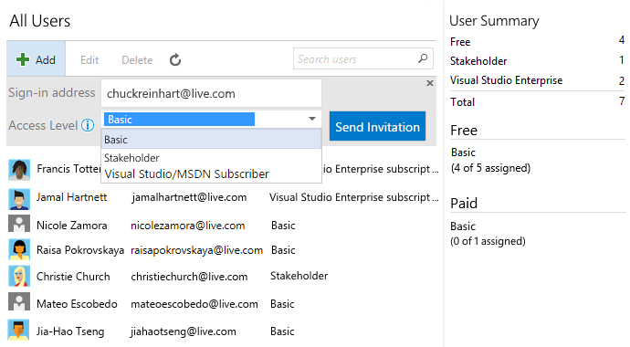

# Create your VSTS Subscription and Dev Team

## How do I get started with Visual Studio Team Services?

* To get started faster, sign up with a personal Microsoft account, like @outlook.com or @hotmail.com.

    If you don't have one already, create a Microsoft account first.

* Or if you're in an organization and need more control over who can access your Visual Studio Team Services account, sign up with a work or school account.

# Sign up for Visual Studio Team Services with a Microsoft account

1. For the best experience, use one of these supported browsers with your Team Services account.

2. Sign in to Visual Studio Team Services with your Microsoft account.

    If you're a Visual Studio subscriber and get Visual Studio Team Services as a benefit, use the Microsoft account associated with your subscription. 

3. Name your Visual Studio Team Services account. Choose Git or Team Foundation as your version control.

4. Confirm your account's location. 

    Team Services will create and name your first team project "MyXamarin", using Agile as the default process to organize your work. You can rename your team project, change the account location, or select another process, like Scrum.

5. After Visual Studio Team Services creates your account and team project, add code, work items, or users.

Congratulations, you're now a Visual Studio Team Services account owner! 

## Manage Users Access - Set your Team!

1. Sign in to your Visual Studio Team Services account (https://{youraccount}.visualstudio.com).

    You'll need account owner or project collection administrator permissions.

2. Go to the Users hub. 

3. Add users with their sign-in addresses. You can add:

    * Unlimited Visual Studio subscribers

Team Services will recognize and validate these subscribers after they sign in.
    
    * Unlimited Stakeholders
    Assign this access to users who just need to work with your backlog, for example, create or edit work items and queries. Learn about working as a stakeholder.

    * Up to 5 additional free users with Basic access
    For example, here's what a team might look like after paying for more users: 

OK, now assemble all your team members, and make sure you put photos on every member :)

## Next

[Lab 1.2](lab12.md) - Clone your project from Github

