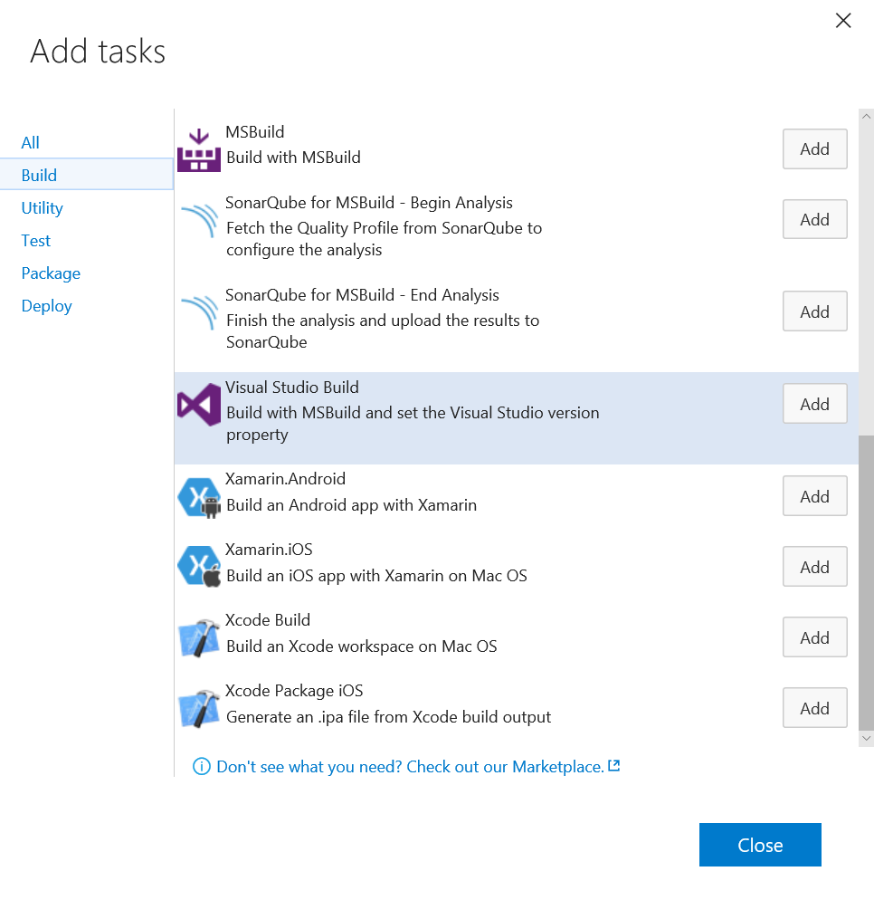

# Create your Android Build Definition

In this step we're going to configure a build definition targeting the Android Platform. Xamarin enables you to develop a single solution and deploy it to Android, iOS, and Windows devices. After you define three CI builds, you can build the app whenever your team checks in code.

1. In VSTS open your team project and go to the BUILD tab. in here we’re going to create a new build definition by clicking the green + sign.

     

2. Select the Xamarin.Android template which is already created by Microsoft for you.

     

3. Select the  repository containing the solution and select the branch you want to deploy. you can even choose to build apps that are stored in different sources such as GitHub or remote Git repositories.

   After everything is set click on Create  

     

   A build definition will be created and several build steps are generated for you. We’ll go over them one by one.  

     

4. The first step is setting up your Xamarin license steps that will activate and deactivate your Xamarin license which is needed to execute the build of your Xamarin.Android project. 

   In this step you have to enter your email and password. Please note that the password field is a plain textbox and no password box. to fix this go to the “Variables” tab and create a variable with your password while you check the lock icon on the right. now you can store your password without other people being able to see it.  

     

5. After you’ve created the Variable enter your email address and password variable into the 2 Xamarin License Steps (1 for activation and 1 for deactivation)

     

   Please note that the deactivation step is set  to always run (even if the build crashes half way)  

6. Next we’ll be removing the Xamarin Test cloud build step in our build. Xamarin test cloud is a very nice tool to test your app on real devices but for this blogpost it’s a bit off topic. if you want to know more about how this works let me know and I’ll write another blog post about it.  

   I’ll also be deleting the MSBuild step that would build the unit test projects since the project does not have any unit tests.  

   Now the Xamarin license is set up we will start building the actual Android app. To do this we first need to add an extra build step to our build definition by pressing the Add Build Step button  

7. Add a Visual Studio Build step. 

     

8. Drag the recently added build task to the 4th position, after the Build Xamarin task.

9. Now let's review all build tasks and configure them. Select the 'Nugget Restore' Task and configure it to the specifical .sln file.

     

   This is all we have to set up for the nuget packages. If you don’t have any nuget packages (is that possible these days?) you can remove this build step.  

10. Now, in the Xamarin Build task, specify the project. It should be configured to 'MyWeather.Droid/MyWeather.Android.csproj', however you can navigate the repo and select the csproj.

     

11. In the Visual Studio Build task, repeat the process and specify the target as 'MyWeather.Droid/MyWeather.Android.csproj'.

     

12. In the Signing and aligning task, we'll specify the target APK. Accordingly to the past build tasks, the apk files should be in '$(build.binariesdirectory)/$(BuildConfiguration)/*.apk'

     

13. Review your Active Xamarin License and Deactivate Xamarin License.

14. Save your build 

     

15. Give it a test spin by clicking “Queue Build”. 

     

   If all is correct your build should now pass. You have the opportunity to see the build happening and when it's finished you have the outcomes available. 

## Next

[Lab 1.4](lab14.md) - Create your UWP Build Definition

