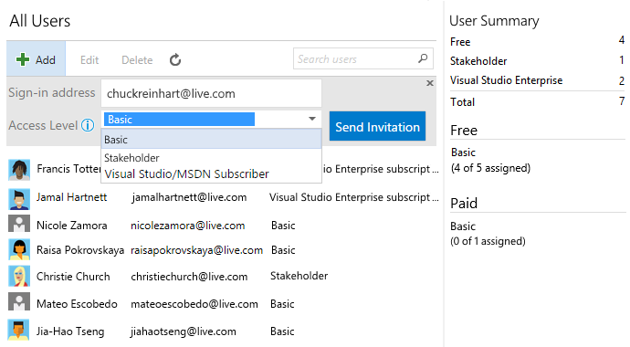

# Create your Android Build Definition

Setting up the build in VSTS

in VSTS open your team project and go to the BUILD tab. in here we’re going to create a new build definition by clicking the green + sign.

Select the Xamarin.Android template which is already created by Microsoft for you.

Select the  repository containing the solution and select the branch you want to deploy. you can even choose to build apps that are stored in different sources such as GitHub or remote Git repositories.

After everything is set click on Create

A build definition will be created and several build steps are generated for you. We’ll go over them one by one.

The first step is setting up your Xamarin license steps that will activate and deactivate your Xamarin license which is needed to execute the build of your Xamarin.Android project. 

In this step you have to enter your email and password. Please note that the password field is a plain textbox and no password box. to fix this go to the “Variables” tab and create a variable with your password while you check the lock icon on the right. now you can store your password without other people being able to see it.

After you’ve created the Variable enter your email address and password variable into the 2 Xamarin License Steps (1 for activation and 1 for deactivation)

Please note that the deactivation step is set  to always run (even if the build crashes half way)

Next we’ll be removing the Xamarin Test cloud build step in our build. Xamarin test cloud is a very nice tool to test your app on real devices but for this blogpost it’s a bit off topic. if you want to know more about how this works let me know and I’ll write another blog post about it. 

I’ll also be deleting the MSBuild step that would build the unit test projects since my sample project did not have any unit tests.

Now the Xamarin license is set up we will start building the actual Android app. to do this we first need to build the PCL project. Add 2 extra build steps to our build definition by pressing the Add Build Step button

First Add a Nuget Installer step.

after that add a Visual Studio Build step. 

Drag both steps to the top so the Nuget Installer is the first step and the Visual Studio Build step is the second.

The nuget installer step will be configured so it will install and update all nuget packages that are part of our solution. select your solution file in the “Path to Solution” field.

This is all we have to set up for the nuget packages. If you don’t have any nuget packages (is that possible these days?) you can remove this build step.

Next we’re going to set up the build of the PCL project. select the Visual Studio Build Step and select all the csproj file(s) that are part of your project.

Set the build platform to AnyCPU and make sure the configuration takes the $(BuildConfiguration) variable.

So now the PCL project builds lets move to the actual Android App build step. 

Select your Android csproj file and make sure that the output directory is set to $(build.binariesdirectory)\$(BuildConfiguration) and the Configuration is set to $(BuildConfiguration)

Now all projects are being built and the only thing we need to do is publish the build artifacts so we can deploy them to Hockeyapp. (you can skip the Android signing step. just leave it as it is)

Set the Path to publish to $(build.binariesdirectory)\$(BuildConfiguration) and set the Artifact name to drop and the artifact type to Server.

Save your build and give it a test spin by clicking “Queue Build” you can also set the build to run automatically by adding a trigger in the Triggers tab. 

if all is correct your build should now pass. on to the next step deploying a release to Hockeyapp!

## Next

[Lab 1.4](https://github.com/DXPortugal/Xamarin.Devops/blob/master/lab14.md) - Create your UWP Build Definition

