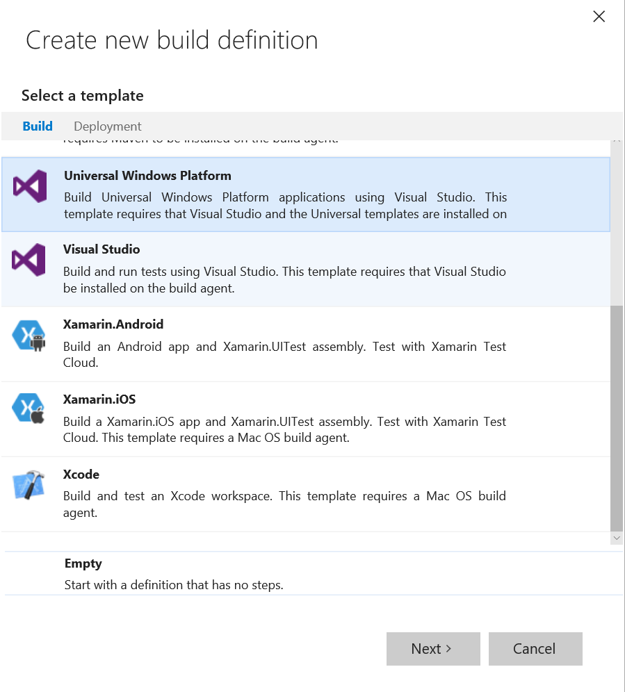
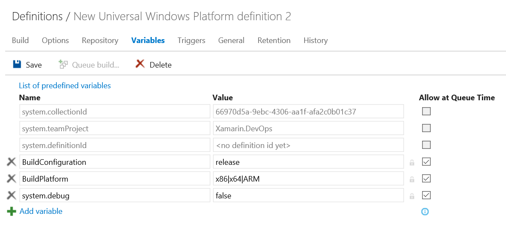
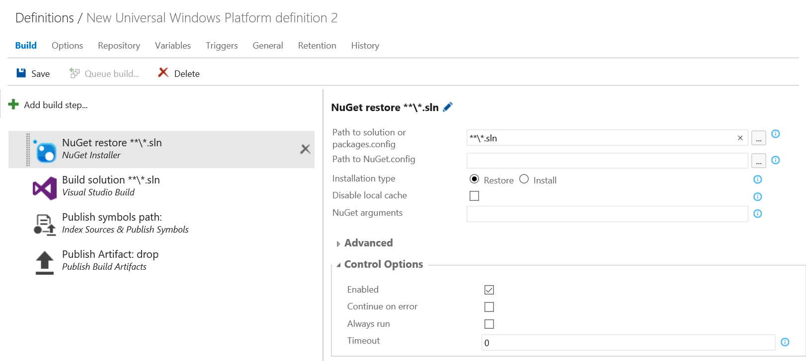
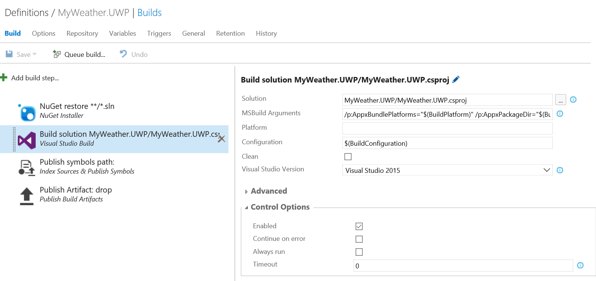

# Create your UWP Build Definition

1. You must upload your .pfx certificate file. Because we're using Git, we can easily do it from command line:

   `C:\code\Xamarin.DevOps>git add MyWeather.UWP\MyWeather.UWP_TemporaryKey.pfx -f`  

   Make sure your certificate file is created locallly. If not, just go to Visual Studio, open the manifest and under Packaging tab, create a test Certificate.

2. Back in VSTS open your team project and go to the BUILD tab. in here we’re going to create a new build definition by clicking the green + sign.

     

3. Choose the Universal Windows Platform build template and click next.

     

4. Select the  repository containing the solution and select the branch you want to deploy. you can even choose to build apps that are stored in different sources such as GitHub or remote Git repositories.

   After everything is set click on Create  

     

5. A build definition will be created and several build steps are generated for you. We’ll go over them one by one.

   Next go to the “Variables” tab and make sure the “BuildPlatform” variable is set to x86|x64|ARM.  

   

6. Back to the build steps. We’ll start with restoring all nuget packages. this step was automatically generated and we only need to set the correct solution. set this to the .sln file that only contains the UWP related projects.

   

7. Next step is building the projects in the Visual Studio build step that is already created for us. Set the solution to the UWP project : 'MyWeather.UWP/MyWeather.UWP.csproj'. Keep Platform field empty.

    

   If you’ve read the Xamarin Android guide as well you might expect what is the next step: publishing the artifacts. but here is when Windows 10 UWP apps start to be different from the Xamarin Android guide.  

To be able to publish both the artifacts: .appxbundle as the zip file we need to remove the predefined step called “publish build artifacts” and replace it with another. We’ll also be removing the “Index sources & publish symbols” step.

## Next

[Lab 1.5](lab15.md) - Create your iOS Build Definition
