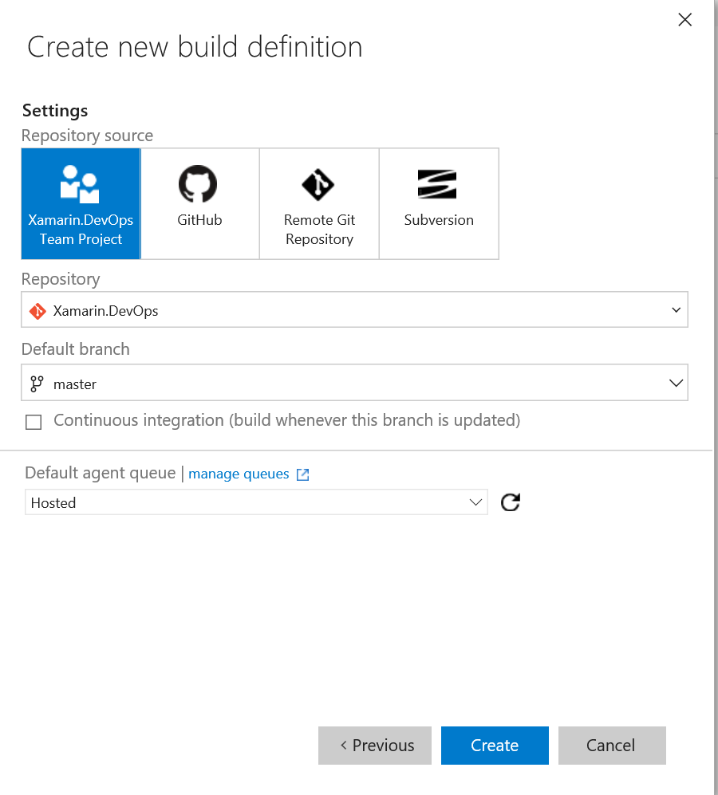

# Create your UWP Build Definition

1. You must also upload your .pfx certificate file. For example if you are working in a Git repo:

`C:\code\Xamarin.DevOps>git add MyWeather.UWP\MyWeather.UWP_TemporaryKey.pfx -f`

1. In VSTS open your team project and go to the BUILD tab. in here we’re going to create a new build definition by clicking the green + sign.

2. Choose the Universal Windows Platform build template and click next.

3. Select the  repository containing the solution and select the branch you want to deploy. you can even choose to build apps that are stored in different sources such as GitHub or remote Git repositories.

After everything is set click on Create

4. A build definition will be created and several build steps are generated for you. We’ll go over them one by one.

but first we need to set some other things up. UWP apps can run on both Mobile devices and tablets or pc’s. this will need different builds focussing on either ARM or the x86 architecture. We’ll set up 1 build definition that will handle both.

To make sure the build runs for each platform we go into the options tab of our build definition and select “Multi-configuration”. set the multipliers to “BuildPlatform” so the build will run for each different build platform we select.

Next go to the “Variables” tab and set the “BuildPlatform” variable to both x86 as ARM

Back to the build steps. We’ll start with restoring all nuget packages. this step was automatically generated and we only need to set the correct solution. set this to the .sln file that only contains the UWP related projects.

Next step is building the projects in the Visual Studio build step that is already created for us. Set the solution to the solution containing the UWP projects and set the platform to the $(BuildPlatform) variable

If you’ve read the Xamarin Android guide as well you might expect what is the next step: publishing the artifacts. but here is when Windows 10 UWP apps start to be different from the Xamarin Android guide.

Hockeyapp does not have any option to upload .appxbundles that contain both ARM ad x86 sources. we need to split them up into 2 packages and then send them to Hockeyapp separately. for Windows 10 Mobile we can still upload an .appxbundle file but for Windows 10 tablet/desktop (x86) we need to send a .zip file containing the .appxbundle, the .cer file and the .ps1 file to install the app on the pc or tablet (installing is currently still manually running the .ps1 file for Windows 10. I hope and expect this will become better in the near future.

To be able to publish both the artifacts: .appxbundle as the zip file we need to remove the predefined step called “publish build artifacts” and replace it with another. We’ll also be removing the “Index sources & publish symbols” step.

